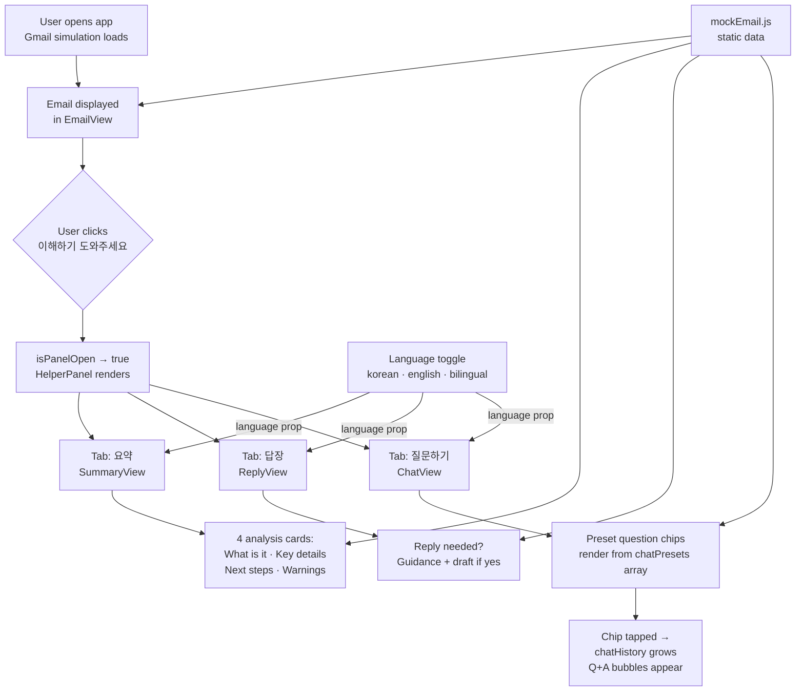

# 이메일 도우미 — Email Helper for My Mom
**AI 201: Creative Coding — Project 3: Persons Required**
SCAD · Spring 2026 · Due May 27, 2026

**Live URL:** *(will be added after GitHub Pages is confirmed live)*

---

## Design Argument

My mom receives important emails about bills, permits, franchise logistics, documents, and official notices, but because of language barriers and low tech confidence, she struggles to understand what the email is asking her to do. She often calls me to translate, explain next steps, forward attachments, or help her write a simple reply.

This project is a web-based prototype of a Gmail helper tool that turns confusing email content into a clear Korean summary, action steps, and simple reply support — meeting her inside the email context instead of asking her to learn a new system.

**The Person**
My mom is a first-generation Korean immigrant who helps my dad manage franchise-related logistics. Some emails she receives are high-stakes and time-sensitive: permits, bills, forms, renewals, document requests, official notices. She is not very comfortable with technology and often faces language barriers when reading emails in English. I am usually the person she calls when she doesn't understand an email.

**The Problem**
My mom can sometimes translate individual words, but she struggles to understand what the email means, what matters most, and what action she needs to take next. Translation alone does not answer the question she is actually asking: *what do I do now?*

**Current Workaround**
She calls or texts me. Sometimes she uses Google Translate, but that only gives her words — not purpose or next steps. She also asks me to help with simple actions like forwarding attachments or drafting a short reply.

**What "Helped" Looks Like**
She opens an important email, reads the Korean summary, identifies the next step, and acts on it without calling me first.

**Why I'm Building This**
I am the person she calls. I have direct access to the problem, I understand where it breaks down, and I speak both languages. I also know how she reads: she skims, she trusts simple language, and she shuts down when something looks complicated.

**Non-Negotiables**
- The tool must feel simple and non-intimidating
- It must not require copy and paste
- It must work inside the email context
- It must explain next steps, not just translate
- Korean must be the primary support language
- The interface must avoid technical language
- It must make her feel more confident, not dependent on another complicated tool
- The first screen must be very clear and not overloaded

**What This Project Is Not**
- Not a generic translation app
- Not a full email client replacement
- Not designed for all users — specifically for my mom's needs
- Not focused on visual polish or complexity over clarity
- Not trying to solve every type of communication, only important action-based emails

---

## Research Documentation

> *This section documents field research conducted before building began. Interview conducted with permission. First name only used per ethical guidelines.*

**Person:** Mom (first name withheld by preference)
**Context:** Observed during a normal moment when she was dealing with emails at home.

*(Interview notes, direct quotes, and environment observations to be added here after Session 14 field research is documented.)*

**Key Observed Pain Points:**
- *(to be filled in from interview notes)*
- *(to be filled in from interview notes)*
- *(to be filled in from interview notes)*

**Direct Quotes:**
> *(Add verbatim quotes from the interview here)*

**Workarounds Observed:**
- *(to be filled in — how she currently copes before this tool exists)*

**Constraints Identified:**
- *(to be filled in — device, literacy level, time, environment)*

---

## Platform Rationale

**Why a web app (Chrome extension-style simulation), not a standalone app:**

The problem happens inside email. A separate app would require her to copy and paste text into another tool, which adds steps, friction, and a context switch she would not reliably make. The correct answer is a tool that lives directly on top of the email — similar to how Grammarly appears while writing.

**Current build:** A Vite + React web app hosted on GitHub Pages that simulates the Gmail + helper panel experience. This allows the prototype to be shared as a URL for First Contact testing without requiring a Chrome extension install.

**Planned next step:** Convert to an actual Chrome extension (manifest.json + content script) after field testing validates the interaction model. The component architecture was written to make this migration clean — the UI is self-contained and does not depend on the full-page web app structure.

**Why not a mobile app:**
She reads emails on her phone but the problem of understanding and deciding what to do next is not a mobile-only problem — it happens whenever she opens email. A URL that works on both desktop and mobile is faster to test and faster to iterate. A native app would require installation, app store submission, and a longer feedback loop.

**Why not a Discord or Slack bot:**
The problem lives in email. Moving the solution to a different platform introduces more steps, not fewer.

---

## System Architecture

**State architecture (App.jsx):**
| State | Type | Controls |
|---|---|---|
| `isPanelOpen` | boolean | Whether helper panel is visible |
| `activeTab` | string | Which panel tab is shown |
| `language` | string | `korean` / `english` / `bilingual` across all sections |
| `chatHistory` | array | Running Q&A exchange in chat tab |

All state lives in `App.jsx` and is passed down as props. No global state library. The language toggle affects every component through a single prop — no text is hardcoded inside child components.

---

## AI Direction Log

> *5+ entries required. Documents what was asked, what AI produced, and what was kept, changed, or rejected.*

**Entry 1 — May 11, 2026**
**Asked:** Set up Vite + React scaffold for a GitHub Pages deployment. Configure base path, GitHub Actions workflow, directory structure.
**Produced:** Complete scaffold with `vite.config.js` (base: `/PersonsRequired_Claude/`), `deploy.yml` using `actions/deploy-pages`, minimal `src/` shell.
**Decision:** Kept as-is. The base path configuration and Pages workflow were correct and matched the repo name. No changes needed.

**Entry 2 — May 13, 2026**
**Asked:** Build the full prototype from the design intent document. Gmail simulation (header, sidebar, email view), helper panel with three tabs (summary, reply, chat), Korean analysis of a real DDS license renewal email, language toggle, preset chat chips.
**Produced:** 11-file React component structure with all features, Korean analysis written in 해요체, full CSS design system in one file, clean state architecture in App.jsx.
**Decision:** Kept the structure and state architecture. The Korean text in the summary sections was reviewed for tone — 해요체 was the right call (polite, not stiff). One adjustment: the chat greeting was simplified from a longer welcome message to a single-line prompt.

*(Entries 3–5+ to be added as build continues through Sessions 17–19)*

---

## Records of Resistance

> *3+ documented moments where AI output was rejected or significantly revised. Each names what AI gave, what was done instead, and why.*

*(To be filled in as development continues. At minimum 3 entries required.)*

**Record 1 — [date]**
**What AI produced:**
**Why it was rejected:**
**What was done instead:**

**Record 2 — [date]**
**What AI produced:**
**Why it was rejected:**
**What was done instead:**

**Record 3 — [date]**
**What AI produced:**
**Why it was rejected:**
**What was done instead:**

---

## User Testing Evidence

> *Documented evidence of the real person using the prototype. Photos, screen recordings, quotes, notes.*

**First Contact — Session 16 (May 13, 2026)**
*(Add observations, quotes, photos, and screen recordings here after the field test. What did she reach for that wasn't there? What did she ignore? What surprised you?)*

**Second Test — Session 17 (May 18, 2026)**
*(Add iteration testing evidence here)*

---

## Five Questions Reflection

> *Completed before final submission. Self-audit of the full project.*

**Can I defend this?**
*(Can every design decision be traced back to the research and to what mom actually needs?)*

**Is this mine?**
*(Did you direct AI based on the Design Argument, or did you accept AI suggestions because they looked good?)*

**Did I verify?**
*(Does the product actually work the way mom needs it to? Was it tested with her, not just in a browser?)*

**Would I teach this?**
*(Can you explain the system architecture, the research process, and the design rationale to another designer?)*

**Is my disclosure honest?**
*(Does the AI Direction Log accurately reflect what happened?)*

---

## Post-Mortem

> *Written reflection on the full Design Cycle. To be completed before Session 20.*

**What worked:**
*(to be filled in)*

**What failed:**
*(to be filled in)*

**What would you do differently:**
*(to be filled in)*

**What you learned about designing for a real person vs. a hypothetical user:**
*(to be filled in)*

---

## Submission Checklist

- [ ] Live URL verified in incognito window
- [ ] Git history clean
- [ ] Design Argument written
- [ ] Research documentation complete (quotes, environment, workarounds)
- [ ] Platform Rationale written
- [ ] Mermaid diagram accurate to final build
- [ ] AI Direction Log — 5+ entries
- [ ] Records of Resistance — 3+ entries
- [ ] User Testing Evidence uploaded or linked
- [ ] Five Questions Reflection complete
- [ ] Post-Mortem complete
- [ ] Case study presentation rehearsed
- [ ] Marketing Minute (60-second video) complete
- [ ] Submitted to Blackboard
