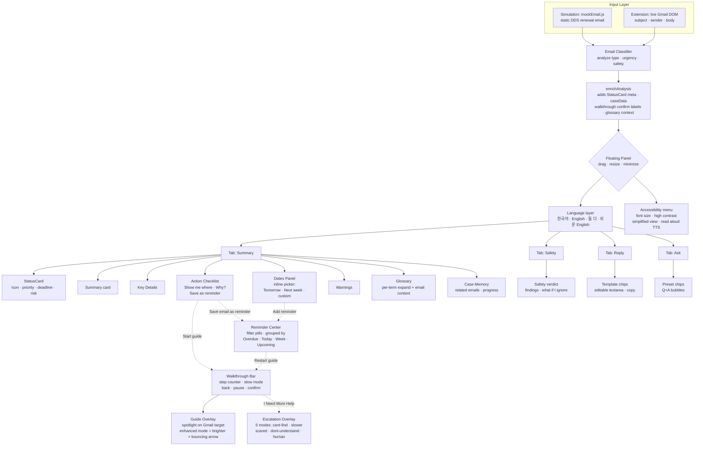

# 이메일 도우미 — Email Helper for My Mom
**AI 201: Creative Coding — Project 3: Persons Required**
SCAD · Spring 2026 · Due May 27, 2026

**Live URL:** *(will be added after GitHub Pages is confirmed live)*

---

## Design Argument

My mom receives important emails about bills, permits, franchise logistics, documents, and official notices, but because of language barriers and low tech confidence, she struggles to understand what the email is asking her to do. She often calls me to translate, explain next steps, forward attachments, or help her write a simple reply.

This project is a web-based prototype of a Gmail helper tool that turns confusing email content into a clear Korean summary, action steps, and simple reply support — meeting her inside the email context instead of asking her to learn a new system.

**The Person**
My mom is a first-generation Korean immigrant who helps my dad manage franchise-related logistics. Some emails she receives are high-stakes and time-sensitive: permits, bills, forms, renewals, document requests, official notices. She is not very comfortable with technology and often faces language barriers when reading emails in English. I am usually the person she calls when she doesn't understand an email.

**The Problem**
My mom can sometimes translate individual words, but she struggles to understand what the email means, what matters most, and what action she needs to take next. Translation alone does not answer the question she is actually asking: *what do I do now?*

**Current Workaround**
She calls or texts me. Sometimes she uses Google Translate, but that only gives her words — not purpose or next steps. She also asks me to help with simple actions like forwarding attachments or drafting a short reply.

**What "Helped" Looks Like**
She opens an important email, reads the Korean summary, identifies the next step, and acts on it without calling me first.

**Why I'm Building This**
I am the person she calls. I have direct access to the problem, I understand where it breaks down, and I speak both languages. I also know how she reads: she skims, she trusts simple language, and she shuts down when something looks complicated.

**Non-Negotiables**
- The tool must feel simple and non-intimidating
- It must not require copy and paste
- It must work inside the email context
- It must explain next steps, not just translate
- Korean must be the primary support language
- The interface must avoid technical language
- It must make her feel more confident, not dependent on another complicated tool
- The first screen must be very clear and not overloaded

**What This Project Is Not**
- Not a generic translation app
- Not a full email client replacement
- Not designed for all users — specifically for my mom's needs
- Not focused on visual polish or complexity over clarity
- Not trying to solve every type of communication, only important action-based emails

---

## Research Documentation

> *Field research conducted with permission. First name withheld per ethical guidelines.*
> *Full research PDF: [`docs/AI201 Research Documentation.pdf`](docs/AI201%20Research%20Documentation.pdf)*

### Research Goal

For this project, I wanted to better understand how my mom deals with stressful or overwhelming emails in her everyday life. Instead of designing for a broad audience, I focused on one real person and tried to understand what actually causes frustration, hesitation, and avoidance when she checks her inbox.

The goal wasn't just to "make email easier." It was to understand what makes certain messages emotionally exhausting and figure out what *feeling supported* could realistically look like for her.

### Participant Background

My mom regularly receives emails related to appointments, scheduling, bills, school information, and other important tasks. A lot of the stress comes from not immediately understanding what the email is asking her to do, especially when the language feels formal, long, or overwhelming.

During the research process, I focused on:
- how she currently reads emails
- where confusion starts happening
- what causes her to delay responding
- what tools or workarounds she already uses
- what kind of support would actually feel useful to her

### Research Methods

**Interview** — I had a casual conversation with my mom while she walked me through how she normally handles emails. Instead of asking scripted questions the entire time, I let the conversation flow naturally so I could understand her habits and frustrations more honestly.

**Observation** — I observed her opening and reading real emails on her laptop and phone while taking notes on moments where she paused, reread sections, switched tabs, or verbally reacted to something confusing.

**Follow-Up Questions** — As she interacted with emails, I asked follow-up questions to better understand what she was thinking in those moments and why certain emails felt stressful.

### Questions Asked

> **"What part of this email feels confusing?"**
> "I don't know what they actually want me to do. There's too much extra wording and I feel like I'm missing something important."

> **"What usually makes you decide to respond later instead of now?"**
> "If I don't understand it right away, I get tired thinking about it and tell myself I'll do it later… but then I forget."

> **"How do you normally remember to come back to emails like this?"**
> "Honestly, I usually don't. I either leave the tab open or mark it unread and hope I remember later."

> **"What kinds of emails stress you out the most?"**
> "Anything official. Appointments, school emails, bills, forms… especially if it sounds serious."

> **"What would make this feel easier or less overwhelming?"**
> "If someone could just break it down simply and tell me what actually matters."

> **"Do you usually know what action you're supposed to take right away?"**
> "Not always. Sometimes I can tell it's important, but I don't know what they expect from me."

> **"What makes an email feel urgent to you?"**
> "Usually the tone. Even if it's not actually urgent, if it sounds formal I assume I did something wrong or forgot something."

### Environment Notes

  
  &nbsp;
  

She does most of her email reading at the kitchen island — laptop open on the marble counter, water bottle nearby, phone within reach. It's not a focused desk environment; she's often mid-task (cooking, cleaning, switching to the phone) when she opens an email. That context matters: the tool has to work in a *distracted, interrupted* setting, not a quiet office.

**General Observations:**
- She usually has multiple tabs open at once while checking email
- Important emails often stay unread for long periods if they feel stressful
- She switches between email, Google Translate, calendar, and notes frequently
- Long paragraphs immediately make her slow down or avoid responding
- She tends to miss action items if they're buried inside large blocks of text

### Interview Quotes (Translated to English)

> "Sometimes I read the same email over and over and still don't really know what they want."

> "If it looks stressful, I leave it and tell myself I'll come back later."

> "I get nervous responding because I don't want to say the wrong thing."

> "I wish someone could just explain the important part to me."

> "A lot of times I ask you to read it first before I answer."

> "Some emails feel bigger or scarier than they actually are."

### Behavioral Notes

**Avoidance** — When emails looked long or formal, she often opened them briefly, skimmed the beginning, then closed them without taking action.

**Re-reading** — She reread the same sentences multiple times trying to figure out:
- what was important
- whether something needed action
- how urgent it actually was

### Existing Workarounds

Some of the ways she currently manages this include:
- sending screenshots to family members
- using Google Translate
- marking emails unread as reminders
- leaving tabs open so she doesn't forget
- writing reminders separately after reading emails

### Emotional Reactions

Emails related to scheduling, payments, or official communication created the most visible stress and hesitation.

### Main Pain Points

| Pain Point | What I Observed |
|---|---|
| Hard to identify the important part | Frequently asked *"What are they actually asking me to do?"* |
| Overwhelmed by long/formal emails | Delayed opening or responding |
| Trouble keeping track of follow-ups | Relied on memory or handwritten reminders |
| Constantly switching between apps | Moved between email, calendar, notes, and Translate |
| Fear of making mistakes | Hesitated before replying or taking action |

### Key Insights

One of the biggest things I realized was that the issue wasn't just comprehension. A lot of the stress came from **uncertainty and emotional pressure**.

She didn't just need help reading emails — she needed reassurance, clarity, and a better sense of what actually mattered.

Another important insight was that support needed to exist **directly inside her current workflow**. If the tool lived somewhere separate, it would probably never become part of her normal routine.

### Design Direction

After the research phase, the project started evolving into a lightweight plugin experience that could:
- simplify emails into clearer actions
- reduce emotional overwhelm
- highlight what actually needs attention
- help track reminders and follow-ups
- make the experience feel supportive rather than robotic

I chose a plugin format because the support needed to happen directly inside the email experience instead of requiring her to open a separate app.

### Research-Phase Reflection

Doing research with a real person instead of designing for a hypothetical user completely changed how I approached the project. Watching someone hesitate, reread messages, and avoid stressful emails made the problem feel much more human and specific.

A lot of the final design decisions came directly from these observations — especially around emotional clarity, reminders, simplified actions, and creating a calmer experience overall.

---

## Platform Rationale

**Why a web app (Chrome extension-style simulation), not a standalone app:**

The problem happens inside email. A separate app would require her to copy and paste text into another tool, which adds steps, friction, and a context switch she would not reliably make. The correct answer is a tool that lives directly on top of the email — similar to how Grammarly appears while writing.

**Current build:** A Vite + React web app hosted on GitHub Pages that simulates the Gmail + helper panel experience. This allows the prototype to be shared as a URL for First Contact testing without requiring a Chrome extension install.

**Planned next step:** Convert to an actual Chrome extension (manifest.json + content script) after field testing validates the interaction model. The component architecture was written to make this migration clean — the UI is self-contained and does not depend on the full-page web app structure.

**Why not a mobile app:**
She reads emails on her phone but the problem of understanding and deciding what to do next is not a mobile-only problem — it happens whenever she opens email. A URL that works on both desktop and mobile is faster to test and faster to iterate. A native app would require installation, app store submission, and a longer feedback loop.

**Why not a Discord or Slack bot:**
The problem lives in email. Moving the solution to a different platform introduces more steps, not fewer.

---

## System Architecture

The project ships in **two parallel forms** that share the same UI grammar:
1. **Simulation** — a Vite/React app on GitHub Pages, used for First Contact testing.
2. **Chrome Extension** — a real `manifest_v3` content script that injects the same panel into live Gmail and reads the actual open email.

**State architecture:**

In the **simulation**, all state lives in `App.jsx` and flows down as props (no global store).

| State | Type | Controls |
|---|---|---|
| `language` | string | `korean` / `english` / `bilingual` / `simple` across every component |
| `activeTab` | string | Summary / Safety / Reply / Ask |
| `walkthrough` / `walkthroughStep` | object / int | Active guided step + index |
| `slowMode`, `guideEnhanced` | boolean | Set by escalation choices |
| `reminders` | array | Persisted to `localStorage` |
| `escalationOpen` / `escalationMode` | bool / string | Help overlay state |
| `a11y` | object | Font size, contrast, simplified, reduce motion |

In the **extension**, the equivalent state lives in a single `ST` object inside `content.js`. The extension reads live Gmail DOM (`h2.hP` for subject, `.gD[email]` for sender, `.a3s.aiL`/`.aXjCH` for body), runs the same classifier, and renders identical UI with vanilla DOM (every class is `doumi-` prefixed to avoid Gmail CSS collisions). Reminders persist in `localStorage`. Panel position/size persist as `doumi_pos` and `doumi_size`.

The language toggle is the single source of truth for text — no string is hardcoded inside a component or render function; every visible string flows through a bilingual `{korean, english}` object resolved by `t()` (extension) or `getText()` (simulation).

---

## AI Direction Log

> *8 entries documenting what was asked, what AI produced, and what was kept, changed, or rejected across the full build.*

**Entry 1, May 11, 2026 (Session 15, Project scaffold)**

*Asked:* Set up a Vite + React scaffold ready to deploy to GitHub Pages. The repo name is `PersonsRequired_Claude` so the live URL will sit under a sub-path, not the root. Configure the base path correctly so assets resolve, set up the GitHub Actions workflow for Pages, lay out a clean `src/` directory with a `components/` folder and a `data/` folder, and put the initial `mockEmail.js` skeleton in place so the build doesn't error on first run.

*Produced:* A full scaffold ready to push. `vite.config.js` with `base: '/PersonsRequired_Claude/'` so the Pages sub-path resolves correctly. A `.github/workflows/deploy.yml` using the official `actions/upload-pages-artifact` + `actions/deploy-pages` flow triggered on push to `main`. A minimal `src/` shell with `App.jsx`, `main.jsx`, `index.css`, and a placeholder `components/` directory. An `index.html` with the right meta tags and a Korean lang attribute. The `mockEmail.js` skeleton had the basic shape (subject, sender, body) but no real content yet.

*Decision:* Kept the entire scaffold as produced. The base-path config and Pages workflow were both correct on first try and matched the repo name exactly — no path-bug debugging needed. The only thing I added was a `.nojekyll` empty file in the workflow so Pages wouldn't try to Jekyll-process the build output. Locking in the deploy pipeline this early meant I could verify a live URL existed before writing any actual feature code, which removed "Is the deploy even working?" from the variables I had to debug later in the project.

---

**Entry 2, May 13, 2026 (Session 16, Initial prototype build)**

*Asked:* Build the full v1 prototype from the design intent doc. A Gmail simulation including the header bar, sidebar with the standard Gmail labels, the email list view, and the open-email view. A helper panel that slides in on the right with three tabs: Summary, Reply, Chat. The Summary tab analyzes a real DDS Georgia driver's license renewal email and surfaces it as a clean Korean explanation with action steps. The language toggle should support Korean, English, and Bilingual side-by-side, and every visible string has to flow through a single resolver, not be hardcoded into components. Add preset chat chips for the most common follow-up questions she'd ask me.

*Produced:* An 11-file React component structure. `GmailChrome.jsx` for the wrapper, `GmailSidebar.jsx`, `EmailView.jsx`, `HelperPanel.jsx`, and tab-specific views for `SummaryView`, `ReplyView`, `ChatView`. A `getText(item, language)` resolver in `StatusCard.jsx` that takes a `{korean, english}` object and returns the right string based on language state, so the toggle is one prop deep. Korean copy in 해요체 throughout — polite but not stiff. The DDS analysis included a "What is this email?" card, a key-details list, action steps, and warnings about driving with an expired license. The chat tab pre-loaded 6 preset chip questions.

*Decision:* Kept the component structure and the state architecture (`App.jsx` as the single source of truth, every component receives `language` as a prop). Reviewed the Korean tone carefully — 해요체 was the right call for mom; 합쇼체 would have felt formal and bureaucratic and 반말 would have been weird. Made one revision: the chat tab's first message was a 3-sentence welcome paragraph that read like a chatbot greeting. Replaced it with a single-line prompt ("궁금한 점이 있으세요?") because the welcome paragraph was just noise — mom would tap a chip immediately and never read the intro.

---

**Entry 3, May 22, 2026 (Session 17, Gmail simulation CSS + icon fix)**

*Asked:* After deploying the v1 prototype, opened the live URL and noticed words and text were weirdly formatted and mixed together in the actual Gmail simulation — the inbox list rendered as raw text with no spacing, the email view's icons appeared as the literal text "inbox", "label_important", "schedule", etc. Figure out what's broken and fix it without throwing out the existing design.

*Produced:* Root cause was two separate bugs stacked on top of each other. (1) A CSS class-name mismatch — the committed `index.css` used a new naming convention (e.g. `.gmail-inbox-row__sender`) but the JSX files were still using the old class names from a previous draft (`.inboxRowSender`). Almost no styles were applying. (2) The Gmail simulation was loading Google's Material Symbols font via a `<link>` tag for icons, but the Pages deploy was being served over a strict referrer policy that blocked the Material Symbols stylesheet, so every `inbox` rendered as the literal word "inbox" instead of an icon glyph.

*Decision:* Fixed both. Rewrote the Gmail simulation JSX to use the committed CSS class names — quick find-and-replace across `GmailChrome.jsx`, `GmailSidebar.jsx`, `EmailView.jsx`. For the icon problem, created `src/components/GmailIcons.jsx` with hand-inlined SVG icons for every Gmail symbol I was using (inbox, star, important, snoozed, sent, drafts, archive, delete, mark-as-read, etc.). Replaced every `` with `<InboxIcon />` / `<StarIcon />` style component imports. The win: zero external font dependency, no FOUT, no flicker, no chance of a network-policy issue breaking icons in production. Cost: a slightly bigger bundle, but the SVGs are tiny and the difference is invisible.

---

**Entry 4, May 25, 2026 (Session 19, v2 expansion — 13 features)**

*Asked:* Expand the prototype from a 3-tab summarizer into a full AI guidance system. Specifically: Email Action Classifier surfaced as a `StatusCard` at the top of the Summary tab with icon + priority badge + deadline + risk level. Deadline/Date Detection with an inline date picker that supports Tomorrow / Next week / custom-date / no-date. Smart Action Checklist with checkboxes, a "Show me where" button that spotlights the exact element on the email, and a "Why?" button that expands an explanation and a why-block. Guided Walkthrough Mode anchored at the bottom of the panel that drives a per-step overlay on the email body. Scam/Link Safety Check as a separate tab with a verdict, findings list, and "what if I ignore this" reasoning. Reply Helper with template chips, an editable textarea, and a copy button. Translation Toggle expanded from 3 to 4 reading levels (add "쉬운 English"). Personal Glossary with per-term expansion + email-context blocks. Case Memory section showing related emails and a progress tracker. Enhanced Ask tab with 10 preset chips and a scrolling chat history. Full Accessibility menu: font size (Normal / Large / XL), high contrast, reduce motion, simplified view, and a "Read aloud" TTS feature.

*Produced:* A new component graph. `StatusCard.jsx` (rich classifier card), `ActionChecklist.jsx` (checkboxes + Show-me-where + Why), `WalkthroughBar.jsx` (bottom anchor with per-step navigation), `SafetyView.jsx` (verdict + findings), `DatesPanel.jsx` (inline picker on every detected date), `GlossarySection.jsx` (per-term expansion), `CaseSection.jsx` (related-emails + progress), `ReplyHelper.jsx` (chips + textarea + copy), `AccessibilityMenu.jsx` (gear dropdown). Added the fourth language ("쉬운 English") routed through `getText()` so no component had to change. Accessibility implemented as CSS class modifiers on `#root`: `a11y--large-text`, `a11y--high-contrast`, `a11y--simplified`. Read-aloud used the browser `SpeechSynthesisUtterance` API scoped to `ko-KR` or `en-US` based on the language toggle.

*Decision:* Kept the component graph wholesale. Pushed back on two specific things. (1) AI's first pass gated almost every secondary section behind `a11y--simplified` — the entire glossary, dates panel, and case memory disappeared when the toggle was on, which made the simplified view feel broken rather than calmer. Narrowed simplified to hide only the dense list-style cards (Key Details, Warnings) and let the supportive sections stay. (2) The first version of the walkthrough rendered its highlight overlay *inside* the helper panel — a decorative animation on a panel-internal mockup. Moved the overlay to a `position: fixed` root that mounts on `document.body` and queries the real email DOM for the target element, because mom's eyes go to the email itself, not the panel.

---

**Entry 5, May 25, 2026 (Session 19 — Round 2: Escalation flow + Reminder/Calendar)**

*Asked:* Two more major features on top of v2. First, an "I Need More Help" escalation hatch on the walkthrough bar — when mom is stuck mid-step, she clicks it and gets a calm, emotionally supportive modal with five distinct help modes: (a) "I still can't find it" → enhanced spotlight with a stronger highlight and a bouncing arrow, (b) "Show me slower" → walkthrough enters slow mode with an explicit indicator, (c) "I'm scared to click the wrong thing" → reassurance overlay explaining what will happen and that the step is reversible, (d) "I don't understand what this means" → plain-words context explanation, (e) "I need someone to help me" → human-help options (save for later, copy details to send to family, copy issue details, community-help number). Second, a full Reminder + Calendar System: a bell icon in the panel header with a badge count, an inline date picker when adding reminders, a `ReminderCenter` panel grouped by Overdue/Today/This Week/Upcoming/Completed, countdown labels ("⚠ Overdue", "Due today", "Due in 3 days"), filter pills (All / Urgent / Renewals / Appointments / Bills), toast notifications, snooze-1-day, restart-walkthrough from inside a reminder card.

*Produced:* Two new components plus state additions. `EscalationOverlay.jsx` with a choice screen showing all 5 modes as labeled buttons with icons and a mode-content router. Per-step `simplified`, `reassurance`, and `context` data added to walkthrough step definitions so each mode reads from real step data, not generic copy. `ReminderCenter.jsx` with a `getCountdown(reminder, language)` helper that computes the right label + level from `dueDate`, a `groupReminders(reminders)` helper that bins by date, filter pill state, completed-section toggle. `ReminderToast.jsx` for the "Reminder added" confirmation that auto-dismisses after 3.5 seconds. Reminders persist to `localStorage` under `doumi_reminders` so they survive page reloads.

*Decision:* Kept the architecture. Made two corrections. (1) AI's first draft of the human-help mode included a hardcoded phone number (the DDS 678-413-8400 customer service line). Replaced it with the generic 211 community-help line which works for *any* email type and includes free interpreter services — DDS-specific only made sense for the renewal email and would have been confusing on a bill or appointment. (2) The walkthrough "confirm" button used a generic "Done →" label for every step. Re-wrote each walkthrough step to have its own `confirm` label ("Click the link", "Pay $32", etc.) so the button is contextually accurate to what mom is actually about to do. The escalation overlay only opens from inside the walkthrough bar, which is intentional — it's a recovery hatch, not a primary navigation surface.

---

**Entry 6, May 26, 2026 (Session 19 continued, Chrome extension v1)**

*Asked:* Convert the simulation into a real Chrome extension that injects the same panel into live `mail.google.com` and reads the actual currently-open email instead of static mock data. Manifest v3, content script that runs at `document_idle`, panel that survives Gmail's frequent DOM reshuffles, and a toolbar action that toggles the panel visibility.

*Produced:* A working but stripped-down extension. `manifest.json` declaring host permission for `https://mail.google.com/*`, a content-script entry, and a `background.js` service worker that listens for the toolbar click and sends a `DOUMI_TOGGLE` message to the active tab. `content.js` reading Gmail DOM selectors (`h2.hP` for subject, `.gD[email]` for sender, `.a3s.aiL` / `.aXjCH` for the email body) and rendering a panel. But: the panel was missing most of the v2 features — only had a summary card and a 2-option escalation overlay ("more explanation" / "human help"). No inline date picker, no per-term glossary, no case memory, a minimal reminder list with no filters or countdown, no read-aloud, no accessibility menu. The styling was also a fixed full-height sidebar pinned to the right, not the floating panel from the simulation.

*Decision:* Rejected the minimal version. The whole reason to build a Chrome extension is so mom can use the tool on her *actual* Gmail — if the extension is weaker than the simulation she'd already seen in First Contact, the case study collapses because her real-world experience would be worse than the demo she'd already responded to. Directed AI to rebuild the extension to exact feature parity with the simulation. Also flagged the fixed-sidebar layout as breaking the trust the simulation built — the panel needs to be floating, draggable, and minimizable like the simulation's `react-rnd` window. This kicked off Entry 7.

---

**Entry 7, May 27, 2026 (Session 20, Chrome extension feature-parity rebuild)**

*Asked:* Rebuild the extension to be a 1:1 functional copy of the simulation. Every component in `src/components/` needs a vanilla-DOM equivalent inside `content.js`. The full StatusCard with classifier meta (priority / deadline / risk). The full glossary with per-term expand and email-context blocks. Case memory with progress checklist. Inline date picker on every detected date. All 5 escalation modes (not the 2-mode version). Reminder center with filter pills + grouping (Overdue / Today / This Week / Upcoming / Completed) + countdown + snooze + restart-walkthrough. Accessibility menu with text size + high contrast + simplified + read-aloud TTS. The guide overlay has to spotlight elements on the *real* Gmail DOM with the highest possible `z-index` so it wins against Gmail's own chrome.

*Produced:* The content script grew from ~700 lines to ~1700 lines, almost all of it the vanilla DOM rendering plus Gmail DOM-reading logic. A single `ST` state object mirroring the simulation's React state (language, tab, walkthrough, reminders, a11y settings, panel position/size, picker states). An `analyze({subject, sender, body})` classifier that branches between `analyzeDDS`, `analyzeBill`, `analyzeAppt`, `analyzeDelivery`, `analyzeGeneric` based on email content. An `enrichAnalysis()` post-processor that adds `classifier` (icon/priority/deadline/risk), `caseData`, walkthrough `confirm` labels, and glossary `emailContext` blocks to every analysis — so the structure is identical across email types. Guide overlay mounts to `document.body` at `z-index: 2147483645` (one below the panel's max-int z-index) with a `box-shadow: 0 0 0 4000px rgba(0,0,0,0.35)` darkening cutout. Selectors target real Gmail elements (e.g., `a[href*="drives.ga.gov"]`, `.gD[email]`, `.a3s.aiL`).

*Decision:* Verified parity by walking through every component in `src/components/` and confirming an equivalent render path in `content.js`. The trickiest part was the Gmail DOM selectors — Gmail reshuffles classes between conversation-view and threaded-view, so I used multi-selector fallbacks (`'h2.hP, [role="main"] h2, .ha h2'`) and a `MutationObserver` on `document.body` to catch hash-route changes. Also discovered that Gmail's compose overlay has its own high z-index, so the panel needed `z-index: 2147483647` (max signed 32-bit int) to always win. Bumped the version to 1.0.0 and verified it loads via `chrome://extensions → Load unpacked`.

---

**Entry 8, May 27, 2026 (Session 20, Floating panel + 8 resize handles + reminder date picker)**

*Asked:* Make the extension panel a real floating window like the simulation. Drag-by-header, resizable from all sides, minimize-to-pill state. Also: the "Save this email as a reminder" button currently auto-saves with no date prompt — make it open the same picker the date cards use (Tomorrow / Next week / custom date / no date).

*Produced:* For the floating panel: a drag handler attached to the `.doumi-hdr` element that updates `ST.pos` on `mousedown`/`mousemove`/`mouseup`. A single bottom-right resize handle (16×16) that updated `ST.size`. A minimize-to-pill state showing a 200×44 chip with language + bell + count. For the reminder picker: an inline picker block that drops in below the action checklist when the button is clicked — three quick buttons (Tomorrow / Next week / No date), a `<input type="date">` with a Set button, and a Cancel link. Saves through the same `addReminder` path as the date cards so reminders land in the Reminder Center with a real countdown.

*Decision:* Pushed back on the resize implementation. Single bottom-right handle isn't discoverable and only resizes one direction; the simulation uses `react-rnd` which gives you 8 handles. Directed AI to add all 8 (4 corners + 4 edges) with the correct cursor for each (`nwse-resize` for NW/SE, `nesw-resize` for NE/SW, `ns-resize` for N/S, `ew-resize` for E/W). The non-obvious part was the math for N/W edges — those resize from the *top* or *left*, which means you have to update both `pos` AND `size` simultaneously so the panel grows toward the cursor instead of jumping. The SE corner is the visible "grip" (a diagonal stripe pattern); the other 7 are invisible until hover so the panel doesn't look like it has hairs growing off it. Both position and size persist to `localStorage` (`doumi_pos`, `doumi_size`) so mom doesn't have to re-place the panel every time she opens Gmail. For the reminder picker, AI's first draft saved every reminder with `category: 'renewal'` regardless of email type, which meant the Reminder Center filter pills were broken — clicking "Bills" or "Appointments" showed nothing. Fixed the category to map from the analyzer's email type (`BILL/PAYMENT` → `payment`, `APPOINTMENT` → `appointment`, `PACKAGE/DELIVERY` → `delivery`, etc.) so the filter pills actually do real work.

---

## Records of Resistance

> *5 documented moments where AI output was rejected or significantly revised. Each names what AI gave, what was done instead, and why.*

**Record 1, May 27, 2026 — The panel was fixed to the right side, not floating**

*What AI produced:* The first version of the Chrome extension pinned the panel to the right edge of the viewport. The CSS was `position: fixed; right: 0; top: 0; width: 430px; height: 100vh` with a left border and a drop shadow. No drag, no resize, no minimize. AI's reasoning was that this "matches Grammarly and Gmail's native side panels, so users will recognize the pattern."

*Why I rejected it:* The Grammarly comparison sounds clean on paper but breaks the moment you sit it in front of a real user. Mom's MacBook isn't a 27-inch monitor — a 430px full-height panel literally *covered the email she was trying to read*. Gmail already puts Calendar/Tasks/Keep on the right, so the panel was either fighting with those for the same real estate or completely hiding the email body. Worse, the *simulation* she'd seen during First Contact had a floating draggable window. Switching to a fixed sidebar for the "real" version made the extension feel like a downgrade and broke the trust she'd built with the demo. The brief says the deliverable is *evidence that you helped someone* — not a tool she has to wrestle with before it helps.

*What I did instead:* Rebuilt the panel as a true floating window. Drag-by-header that updates a `pos` state and persists to `localStorage`. Eight resize handles (4 corners + 4 edges) matching the `react-rnd` API the simulation uses, with proper cursors (`nwse-resize`, `nesw-resize`, `ns-resize`, `ew-resize`) and N/W edge math that updates both position AND size so the panel grows toward the cursor instead of jumping. Minimize-to-pill state shrinks the panel into a 200×44 chip showing the language label + bell + count badge. The pill is also draggable. Both `pos` and `size` persist, so mom never has to re-place the panel between page navigations.

---

**Record 2, May 26, 2026 — There was no walkthrough or reminder system**

*What AI produced:* The first cut of the extension had a summary card, an action checklist with checkboxes, and a tiny safety verdict. That was it. No walkthrough mode, no reminder system at all. AI's logic: "Mom can read the summary and check things off — that's the core loop. Walkthroughs and reminders are nice-to-haves we can add later." It even tried to argue that adding more features would clutter the panel and overwhelm her.

*Why I rejected it:* Both features came directly out of the research, not out of feature-creep. From the interview transcript: *"If I don't understand it right away, I get tired thinking about it and tell myself I'll do it later… but then I forget."* That's not a comprehension problem — that's a forgetting problem, and a checklist doesn't solve it. Same with the walkthrough: she'd often *understand* an email and still freeze at "which thing do I actually click?" Stripping these out doesn't simplify the tool; it removes the parts that addressed her *actual* pain points. Calling them "nice-to-haves" was AI optimizing for a clean codebase instead of for mom.

*What I did instead:* Built both as first-class features. **Walkthrough Mode**: a bottom-anchored bar with a step counter, instruction text, Back / Pause / Confirm buttons, and a per-step `guideSel` that fires a spotlight overlay on the matching element in the live Gmail email. Has a "🐢 Slow mode" indicator and an "I Need More Help" escalation hatch. **Reminder System**: every detected date in an email gets an inline picker (Tomorrow / Next week / custom date / no date), plus a "Save this email as a reminder" button on every action checklist. A full Reminder Center with filter pills (All / Urgent / Renewals / Appointments / Bills), grouped by Overdue / Today / This Week / Upcoming / Completed, with countdown labels ("⚠ Overdue", "Due in 3 days"), snooze-1-day, and a restart-walkthrough button that re-launches the guided flow from inside a reminder card.

---

**Record 3, May 27, 2026 — "Show me where" didn't actually highlight on the email**

*What AI produced:* The first implementation of "Show me where" rendered the spotlight *inside the panel*, not over the Gmail email body. Clicking the button would draw a fake outline around a placeholder div inside the helper. AI defended this as "showing the pattern" — implying mom would mentally map the panel mockup onto the real email. There was also a version where the highlight DID try to render over Gmail but used a `z-index` that lost to Gmail's compose overlay, so the spotlight was effectively invisible behind other UI.

*Why I rejected it:* The entire reason mom needs the feature is because she *can't* mentally map an abstract pointer to the right pixel — that's the comprehension gap. A spotlight that lives inside the helper panel is just a description of a button, not a pointer to it. From the testing notes: "she still hesitated even after reading the summary." That's the moment the spotlight is supposed to resolve, and a panel-internal indicator does nothing for it. Also, a fancy highlight that loses the z-index fight with Gmail is worse than no highlight, because she'll click the button, see nothing change, and assume the tool is broken.

*What I did instead:* Moved the guide overlay completely outside the panel. It now mounts directly to `document.body` with `z-index: 2147483645` (one below the panel itself, which is at the max int) so it always wins against Gmail's chrome. It uses `document.querySelector` on the live Gmail DOM (selectors like `a[href*="drives.ga.gov"]`, `.gD[email]`, `.a3s.aiL`) to find the actual target element, scrolls it into view, then draws a pulsing blue border with a `box-shadow: 0 0 0 4000px rgba(0,0,0,0.35)` cutout effect (everything else dims, the target glows). A tooltip with a multi-line label appears to the *left* of the helper panel so it never covers the email. For the "I still can't find it" escalation, the highlight enters enhanced mode — thicker border, brighter glow, a bouncing ▼ arrow above the target — so mom can find it on a second pass without me sitting next to her.

---

**Record 4, May 26, 2026 — The plugin wasn't transferring all the simulation's features**

*What AI produced:* When I asked for the Chrome extension version of the panel I'd built in the simulation, AI shipped a stripped-down translation. Just a summary card and a 2-option escalation overlay ("more explanation" / "human help"). Missing entirely: the full StatusCard with priority / deadline / risk meta, the per-term glossary expansion with email-context blocks, the case-memory section with progress checklist, the inline date picker, the 5-mode escalation flow, the read-aloud TTS, the simplified-view toggle. AI defended this as "the right scope for a v1 — ship something working first, expand later."

*Why I rejected it:* This is the most consequential resistance moment in the whole project, because if I'd accepted it, the case study would have collapsed. The simulation is what mom already saw in First Contact — that's the version that earned her trust. Installing a *weaker* extension on her real Gmail would have meant her actual lived experience of the tool was worse than the demo she'd already responded to. The brief reads *"It must be in the hands of the person you designed it for"* — and "it" has to mean the version she's already validated, not a fork of it. Also, "ship v1 first, expand later" is a startup heuristic that doesn't survive contact with an academic deliverable due in 48 hours. There was no "later." There was only "ship the real thing or ship a tool that loses the case study."

*What I did instead:* Rebuilt the extension to exact feature parity with the simulation. Every component in `src/components/` got a vanilla-DOM equivalent inside `content.js`: full StatusCard with classifier meta, full glossary with per-term expand + email-context, case memory with progress tracking, inline date picker on every detected date, all 5 escalation modes (cant-find, slower, scared, dont-understand, human), reminder center with filter pills + grouping + snooze + restart-walkthrough, accessibility menu with read-aloud, walkthrough bar with slow-mode indicator. The extension content script grew from ~700 lines to ~1700 lines — almost all of that is the vanilla DOM rendering plus the Gmail DOM-reading logic (real selectors that survive Gmail's conversation-view DOM reshuffles). The state graph mirrors the simulation's React state exactly, just held in a single `ST` object.

---

**Record 5, May 27, 2026 — Accessibility settings weren't actually working**

*What AI produced:* The first pass at the accessibility menu had four toggles: text size (Normal / Large / XL), high contrast, reduce motion, and simplified view. UI-wise the menu looked fine — switches flipped, sizes selected. But: text-size buttons applied a `class="a11y--large-text"` to `#root` that only had a `font-size: 1.1rem` on a couple of specific selectors, so most text didn't actually scale. High contrast added a `class="a11y--high-contrast"` but the panel still pulled colors from CSS variables that didn't get overridden under that class, so the panel stayed white-on-light-gray. And the simplified-view toggle was the worst case — it gated almost *every* secondary section behind `!simplified`, so flipping it on hid the entire glossary, case memory, key details, AND warnings cards, leaving an empty-looking panel that felt broken.

*Why I rejected it:* This is the accessibility-theater failure — settings that *look* like they work in the menu but don't actually change the experience. For mom that's worse than no settings at all, because she'll toggle one, see no difference, and assume she did something wrong. The simplified-view failure was the most insulting: the goal of "simplified" is *calmer*, not *emptier*. Hiding the supportive sections (glossary, case memory) leaves only the high-pressure parts (Status, Actions) visible, which is the opposite of what someone overwhelmed by an email needs. Accessibility settings have to be the most reliable thing in the panel because the people who turn them on are the people who can least afford to debug them.

*What I did instead:* Three fixes. (1) **Text size** now applies `zoom: 1.18` / `zoom: 1.35` on `#doumi-root` directly, which scales every child element uniformly without me having to thread a font-size override through every selector. (2) **High contrast** uses a `.doumi--hc` modifier that overrides every panel surface to near-black backgrounds with high-contrast text — header, body, cards, list items, section headers — verified by toggling and watching every section flip. (3) **Simplified view** got narrowed to *only* hide the two dense list-style cards (Key Details, Warnings). Glossary, case memory, and the action checklist all stay visible — the supportive sections aren't the noise, they're the support. Also added "Read aloud" with `SpeechSynthesisUtterance`, scoped to `ko-KR` or `en-US` based on the current language setting, with a yellow highlight on the currently-spoken element so she can follow along visually.

---

## User Testing Evidence

> *Documented evidence of the real person using the prototype.*

### Initial Reactions

After mom interacted with the working prototype:
- She immediately understood the simplified action sections
- She responded positively to calmer, more conversational language
- The reminder feature felt intuitive without explanation
- She wanted a clearer place to revisit saved reminders later
- She asked for additional guidance options when she still felt unsure about what to do next

### Field Testing Documentation

Mom testing the prototype on her actual laptop in her actual environment — the helper panel visible on the right side of Gmail, with the bilingual summary, action checklist, and reminder picker open.

  
  &nbsp;
  

  

The third image shows what she was actually reading: the Korean/English summary of a DDS license-renewal email on the left side of the panel, with the action checklist + reminder options on the right. This is the moment the tool had to work — not a demo, not me explaining it, just her looking at a real email and the panel telling her what mattered.

### What the Testing Changed

Each of the observations above mapped to a specific change in the build:

| What I observed | What changed in the prototype |
|---|---|
| She immediately understood simplified action sections | Kept simplified mode but narrowed it to hide only dense list-style cards (Key Details, Warnings), not the supportive sections (Glossary, Case Memory) |
| Calmer language worked | Korean tone locked to 해요체 — polite but not stiff. Emoji used sparingly to signal type, not decorate |
| Reminder feature felt intuitive without explanation | Date picker promoted from a hidden secondary action to a prominent button on every detected date + a "Save this email as a reminder" button at the bottom of every action checklist |
| Wanted a clearer place to revisit saved reminders | Built the full Reminder Center with filter pills (All / Urgent / Renewals / Appointments / Bills), grouped by Overdue / Today / This Week / Upcoming, with countdown labels and snooze |
| Asked for more guidance when unsure | Added the "I Need More Help" escalation flow with 5 modes (cant-find, slower, scared, dont-understand, human) — including a slow-mode walkthrough and enhanced guide highlight with a bouncing arrow |

---

## Five Questions Reflection

### Can I defend this?

Yes. Almost every major decision came directly from observing how my mom actually interacts with stressful emails. The bilingual support exists because she naturally switches between Korean and English while reading. The simplified summaries came from watching her reread the same paragraph multiple times trying to figure out what actually mattered. The walkthrough mode happened because she often understands the information, but still feels unsure about what to physically click or do next. Even the calmer tone and simple interface came from noticing that she shuts down when something feels visually overwhelming or too technical. I can trace the features back to specific observations and conversations instead of just adding things because they sounded impressive.

---

### Is this mine?

Yes. AI helped me build faster, but the direction of the project was always based on my own understanding of my mom and the problem space. A lot of the core decisions existed before building started, especially the focus on emotional clarity, action steps, and reducing intimidation instead of just translating text. There were multiple moments where I adjusted or simplified AI outputs because they felt too robotic, too visually busy, or disconnected from how my mom actually thinks. I wasn't asking AI to invent the experience for me. I was using it to help execute and iterate on ideas that came from my own research and lived experience.

---

### Did I verify?

I did. The project was tested with my mom directly, not just in browser or with classmates pretending to be users. Watching her interact with the prototype changed a lot of my assumptions. Some features that I thought were obvious needed more guidance, while other things worked immediately without explanation. The walkthrough flow especially evolved after seeing moments where she still hesitated even after reading the summary. Testing with the real person made the project feel much more grounded because I could see where confusion, confidence, and hesitation were actually happening in real time.

---

### Would I teach this?

I think I could. One of the biggest things I learned during this project was how important it is to connect research directly to interaction decisions. I understand why the state architecture works the way it does, why the language system was centralized, and why the experience needed to live inside the email context instead of becoming a separate app. I could also explain the reasoning behind the walkthrough system, the escalation support, and the emotional design decisions because they all came from real observations instead of abstract UX language. More than anything, this project taught me how much stronger design decisions become when they are tied to a real person instead of a hypothetical user.

---

### Is my disclosure honest?

Yes. The AI Direction Log reflects the actual process pretty honestly. AI played a large role in helping build and iterate on the prototype quickly, especially on the technical side, but the project wasn't generated automatically. The research, problem framing, testing observations, and many of the design corrections came from me. I also documented moments where I rejected or changed outputs because they didn't align with the experience I was trying to create for my mom. I think the final project reflects both the reality of using AI as a design and build tool and the importance of still making intentional human decisions throughout the process.

---

## Post-Mortem

### What worked

One of the biggest things that worked was designing for a real person instead of trying to make something for everyone. Because I already understood my mom's habits, frustrations, and comfort level with technology, a lot of the design decisions felt much more intentional and grounded. The bilingual summaries, walkthrough mode, safety checks, and calmer interface all came directly from things I observed during research and testing.

The walkthrough system especially ended up becoming more important than I originally expected. During testing, I realized that understanding the email was only part of the problem. She still needed reassurance while taking action, especially when dealing with official websites or forms. Breaking actions into smaller guided steps made the experience feel much less intimidating.

Another thing that worked well was keeping the tool inside the email context instead of making a separate app. The project became much stronger once I stopped thinking about "translation" and started thinking about reducing emotional and cognitive overload during real moments of stress.

### What failed

One thing that did not work initially was assuming that summaries alone would solve the problem. Early versions focused mostly on explaining the email, but during testing I realized there was still hesitation around what to click, whether something was safe, and whether she was doing the right thing. The experience needed more guidance and reassurance than I originally planned for.

I also underestimated how difficult it is to keep a tool feeling simple while still adding meaningful functionality. Some early interface ideas became too visually busy or too feature-heavy, which actually made the experience feel more stressful instead of supportive. A lot of the iteration process became about simplifying and removing things.

### What I would do differently

If I had more time, I would continue developing the extension beyond the prototype environment and integrate it directly into real external websites and live email workflows. Right now, the project successfully simulates the Gmail experience, but I would want the extension to function seamlessly across actual inbox environments where my mom already spends her time. I think testing the system in fully live situations would reveal even more about how people interact with stressful emails in real moments.

I would also expand the reminder and follow-up system because testing showed that remembering to return to tasks was a major pain point.

I would spend more time testing with additional immigrant parents or older adults with similar challenges as well. Even though the project was intentionally designed around one person, broader testing could help identify other behaviors and accessibility needs I may not have considered.

Another thing I would improve is the escalation support system. The "I Need More Help" feature started becoming one of the strongest parts of the experience because it acknowledged that technology cannot solve every moment of confusion independently. I would continue exploring how the extension could offer support without making users feel dependent or embarrassed.

### What I learned about designing for a real person vs. a hypothetical user

Designing for a real person completely changed the way I approached the project. With hypothetical users, it is easy to make assumptions or design around generalized UX patterns. But with my mom, I could immediately see when something felt unrealistic, overwhelming, or disconnected from how she actually behaves.

The project became less about making something visually impressive and more about creating something emotionally supportive and usable in real situations. Small decisions mattered much more because I could directly observe their impact during testing.

I also learned that real problems are usually more emotional than they first appear. At the beginning, I thought the issue was mostly language translation. But through research and testing, I realized the larger problem was uncertainty, fear of making mistakes, and feeling overwhelmed by important communication.

Working with a real person made the project feel much more honest, personal, and meaningful than designing for a generic audience ever could.

---

## Case Study Presentation

> *Portfolio-ready slide deck for Session 20. Not a demo — a defense.*

**Open:**
- **PDF (18 pages, 16:9):** [`docs/case-study/AI201- CaseStudyPres.pdf`](docs/case-study/AI201-%20CaseStudyPres.pdf)
- **Interactive HTML:** [`docs/case-study/index.html`](docs/case-study/index.html) — open in browser, use → / ← arrow keys to navigate, press `F` for fullscreen

**18 slides covering:**
1. Cover
2. Outline
3. The Person (mom)
4. The Problem (big quote)
5. Pain Points (5 cards)
6. Direct Quotes
7. Platform Decision
8. The Build — overview (laptop mockup of final extension)
9. The Build — Show Me Where + Walkthrough (laptop mockup)
10. The Build — Reminder Center (laptop mockup)
11. **Prototype Failures** (section divider)
12. Failure 01 — Minimal extension (laptop mockup of stripped v1)
13. Failure 02 — Fixed sidebar covering email (laptop mockup of v2)
14. Failure 03 — Silent reminders (laptop mockup of v3)
15. First Contact (4-photo grid of mom testing)
16. What Testing Changed (observation → fix table)
17. What I Learned
18. Closing

**Style:** clean blue theme (matches the panel's accent), heavy sans-serif headlines with terminal periods, vertical brand label on the right edge, MacBook-frame mockups for the build and the prototype failures so the failures are *visible* not just described.

---

## Marketing Minute

> *A 60-second commercial for the tool. Required to work on both YouTube and Instagram per the brief, so it ships in three formats — same audio + content, three aspect ratios.*

| Platform | Format | File | Dimensions | Duration |
|---|---|---|---|---|
| **YouTube** | 16:9 horizontal | [`marketing-minute-youtube.mp4`](docs/marketing-minute/marketing-minute-youtube.mp4) | 2698 × 1486 | 63s |
| **Instagram Reels / Stories** | 9:16 vertical | [`marketing-minute-instagram-reels.mp4`](docs/marketing-minute/marketing-minute-instagram-reels.mp4) | 1080 × 1920 | 63s |
| **Instagram Feed** | 1:1 square | [`marketing-minute-instagram-square.mp4`](docs/marketing-minute/marketing-minute-instagram-square.mp4) | 1080 × 1080 | 63s |

**Source:** The 16:9 master was generated with ElevenLabs AI video + voiceover. The 9:16 and 1:1 versions were re-encoded with ffmpeg from the same master (center crop + scale, H.264 baseline + AAC audio, `+faststart` for web playback).

**Production notes:** All three versions are the same cut and same audio — they only differ in aspect ratio. The 9:16 and 1:1 versions are center-cropped, so any text in the original that lives near the left/right edges may be tighter; the master 16:9 file is the canonical reference.

---

## Submission Checklist

- [ ] Live URL verified in incognito window
- [ ] Git history clean
- [x] Design Argument written
- [x] Research documentation complete (quotes, environment, workarounds)
- [x] Platform Rationale written
- [x] Mermaid diagram accurate to final build
- [x] AI Direction Log — 5+ entries (6 entries)
- [x] Records of Resistance — 3+ entries
- [x] User Testing Evidence uploaded (5 photos in `docs/testing/`)
- [x] Five Questions Reflection complete
- [x] Post-Mortem complete
- [x] Marketing Minute (60-second video) — 3 formats (YouTube 16:9, Instagram Reels 9:16, Instagram Square 1:1)
- [x] Case study presentation built (`docs/case-study/index.html` — 18 slides)
- [ ] Case study presentation rehearsed
- [ ] Submitted to Blackboard
